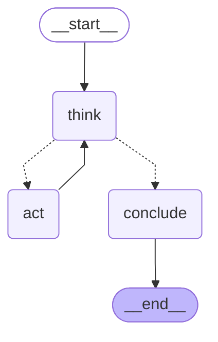
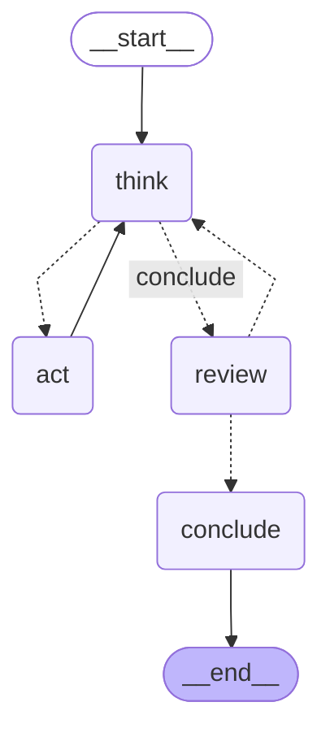

# The investigation graph

Generated from the compiled graphs by `scripts_graph.py`. Do not edit by hand.

## Unattended

How the eval suite runs it. No human, no pauses.

## With review

`review=True`. The run freezes before the finding is published and waits for a
person. A redirect sends it back into the loop with the reviewer's note added
as evidence; accept and reject both end the run.

## Reading it

Solid arrows are unconditional. **Dotted arrows are the conditional edge** —
`decide` chooses between them after every `think`.

| Node | Does |
|---|---|
| `think` | Asks the model what to do next. Returns either a tool call or a finding. |
| `act` | Runs the requested tool and appends the result to `evidence`. |
| `review` | Pauses for a person. Accept, reject, or redirect. Only present when `review=True`. |
| `conclude` | Writes the finding, or records that the run hit its budget. |

The loop is `think → act → think`. It leaves only through `conclude`, and
`decide` is the only thing that can send it there — either because the model
stopped asking for tools, or because the step ceiling was reached.

Those exits are recorded differently in `stop_reason` — `concluded`,
`accepted`, `rejected`, or `budget`. A run that ran out of budget is not a run
that reached a conclusion, and a rejected finding is not an accepted one.
Nothing downstream should be able to confuse them.
